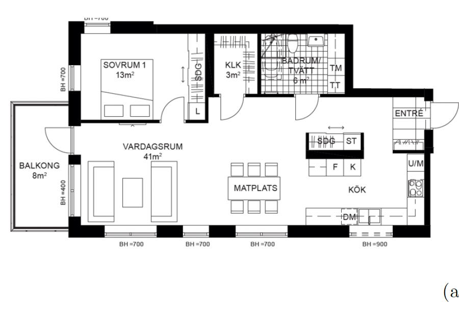
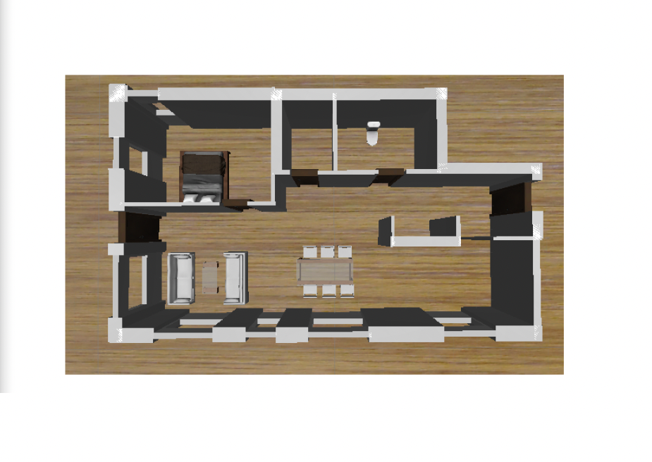

# 🏠 AI Floor Plan Generator

> Transform simple text descriptions into **structured architectural data**, **2D floor plans**, and **3D visualizations** — all powered by AI.

---

## 🌟 Overview

This project takes a **text prompt** (e.g., _"A 3-bedroom house with two bathrooms and a kitchen next to the dining area"_)  
and uses a **Gemini LLM** to convert it into a **structured format (JSON or schema)**.  
Then, a **trained model** generates a **2D floor plan image**, followed by a **3D model rendering** of the layout.

---

## 🧠 Tech Stack

| Component              | Technology Used                   |
| ---------------------- | --------------------------------- |
| 🧩 LLM Text Processing | **Gemini API** (Google AI)        |
| 🗂️ Data Structuring    | JSON schema generation            |
| 🏗️ 2D Plan Generation  | Custom-trained image model        |
| 🧱 3D Rendering        | AI-based 3D reconstruction engine |
| ☁️ Backend             | Python (Flask)                    |
| 💾 Storage             | Local storage                     |

---

## 🖼️ Project Flow

```mermaid
graph TD
A[📝 Text Prompt] --> B[🤖 Gemini LLM: Structured Data]
B --> C[🧭 2D Floor Plan Generator Model]
C --> D[🏗️ 3D Model Generator]
D --> E[🌐 Final Output (Interactive Model)]
```

---

## 🚀 Features

✅ Convert text into structured architectural layouts  
✅ Generate accurate **2D floor plan images**  
✅ Automatically create **3D models** from generated 2D layouts  
✅ Modular architecture — each step works independently  
✅ Extensible for different room types, materials, and furniture

---

## 📸 Screenshots / Demo

### 🧾 Text to Structured Data

To generate from text: Generate architectural floor plan drawing for a apartment. The layout must include a combined living/sleeping area, a small separate bathroom, and a compact kitchenette. Render in a clean, CAD-style.

### 🏠 Generated 2D Floor Plan



### 🧱 3D Visualization



---

**Input Prompt:**

```
To generate from text: Generate architectural floor plan drawing for a apartment. The layout must include a combined living/sleeping area, a small separate bathroom, and a compact kitchenette. Render in a clean, CAD-style.
```

**Generated Structured Data:**

```json
{
  "floor_plan_summary": {
    "rooms": [
      { "name": "Bedroom 1", "purpose": "Sleeping" },
      {
        "name": "Living Room",
        "purpose": "Main social and relaxation area, connected to dining"
      },
      { "name": "Kitchen", "purpose": "Food preparation, connected to dining" },
      { "name": "Bathroom/Laundry", "purpose": "Hygiene and clothing care" },
      { "name": "Entrance/Hallway", "purpose": "Access and circulation" },
      { "name": "Walk-in Closet/Storage", "purpose": "Storage" },
      { "name": "Balcony", "purpose": "Outdoor access and use" }
    ],
    "relationships": [
      {
        "from": "Entrance/Hallway",
        "connects_to": [
          "Living Room",
          "Walk-in Closet/Storage",
          "Bathroom/Laundry"
        ]
      },
      {
        "from": "Living Room",
        "connects_to": ["Bedroom 1", "Kitchen", "Balcony"]
      },
      { "from": "Bedroom 1", "connects_to": ["Living Room"] },
      {
        "from": "Kitchen",
        "connects_to": ["Living Room (Open Concept)", "Entrance/Hallway"]
      },
      { "from": "Bathroom/Laundry", "connects_to": ["Entrance/Hallway"] },
      { "from": "Walk-in Closet/Storage", "connects_to": ["Entrance/Hallway"] },
      { "from": "Balcony", "connects_to": ["Living Room"] }
    ]
  }
}
```

**Generated 2D Plan → 3D Output:**  
_(Insert images above in the screenshots section)_

---

## 🧪 Model Training (Optional)

If you trained the image generation model yourself, you can include this section.

```bash
# Train model on dataset
python train_model.py --dataset data/floorplans --epochs 50
```

Model weights will be saved in `models/2d_generator.pt`

---

## 📦 Project Structure

```
plan_your_house/
├── 2D-Generation/
│   ├── 2d_generator.pt
│   └── 3d_reconstructor.pt
├── FloorPlanTo3D-API/
│   ├── llm_parser.py
│   ├── image_generator.py
│   └── model_trainer.py
├── FloorPlanTo3D-unityUI/
│   └── Ui code
├── requirements.txt
├── README.md

```

---

## 🧾 License

This project is licensed under the **MIT License** — see the [LICENSE](LICENSE) file for details.

---

## 🙌 Acknowledgments

- [Google Gemini API](https://ai.google.dev/)
- [OpenAI](https://openai.com)
- [Blender / Three.js](https://threejs.org/) for 3D rendering
- Everyone contributing to open-source AI & architecture tech 💙

---
